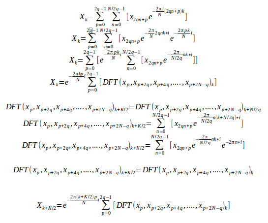

# Table of Contents

1. Puprose of the project
2. Different transforms used to transform the signal from time domain into frequency domain
3. FFT - Fast algorithms used to calculate Fourier transform


# 1. Purpose and goal of the project
- The purpose of this project is to make a fingerprint of an audio record/file (usually larger than half-an-hour). In this project we decided to try to do it by extracting 2<sup>n</sup> lower frequences (usually 1024 or 2048) from the signal.
- There are several invertible transforms (data can be fully retrieved from the transformed data, by the corresponding inverse-transform) that transform N discrete signals in time domain into N values in frequency domain. 
- We chose to single out K << N (K=2<sup>n</sup>, n is integer) values on a frequency domain using some Fast FFT-like algotithms (will be mentioned later in the document). By choosing to analyse only K frequences some data will be lost, but there will remain enough data to recognize the song (in most cases). In fact, it is actually useful to reduce the quality of the song in fingerprinting for many reasons, some of which are:
     1. Some files which represent the same song may differ in just a few signals, therefore reducing the quality of the song would actually "normalize" the record, thus making those two files virtually same, or at least similar enough to recognize that those two files actually represent the same record.
     2. If fingerprints are smaller it requires less time to compare and analyse the fingerprints of two different files (and to compress them), especially when they are enormousl in size.
     3. ...

# 2. Different transforms used to transform the signal from time domain into frequency domain

There are several Fourier-like transforms that can be use for this purpose, so we will first introduce "Fourier transform" and a few Fourier-like transforms which can also be used for this purpose. At the and, we will explain why we suggest using MDCT, and why we put it in front of Fourier-transform and other Fourier-like transforms.

##      2.1. Fourier transform and Discrete Fourier Transform
-------
The Fourier transform decomposes time domain signal into the the frequencies (of sine and cosine functions) that make it up, similarly to how a musical chord can be expressed as the amplitude (or loudness) of its constituent notes. The Fourier transform of a function of time itself is a complex-valued function of frequency, whose absolute value represents the amount of that frequency present in the original function, and whose complex argument is the phase offset of the basic sinusoid in that frequency.


The Fourier transform is called the frequency domain representation of the original signal. 


http://en.wikipedia.org/wiki/Fourier_transform
http://en.wikipedia.org/wiki/Discrete_Fourier_transform).

### Formula
-------
**Fourier transform** of non-discrete signal x:   


**Inverse Fourier transform** of frequency domain signal x:


As in praxis we can only analise discrete time domain signal, let's define discrete fourier transform formulas:

**Discrete Fourier Transform** of discrete signal/vector x (transform N time-domain signals into N frequency-domain signals):   


**Inverse Discrete Fourier Transform** of discrete signal/vector X (transform N frequency-domain values into N time-domain signals):   


# 2.2. Sine and Cosine transforms
    
Fourier sine and cosine transforms are forms of the Fourier integral transform that **do not use complex numbers**.

Those transforms are the forms originally used by Joseph Fourier and are still preferred in some applications, such as signal processing or statistics (supposedly due to avoiding the calculations with complex numbers)..

Formulas of Sine and cosine transforms:
-----------------
**Fouruer sine transform** of non-discrete signal ***f(t)***, sometimes denoted by either  or
 f(t):   


**Fouruer cosine transform** of non-discrete signal ***f(t)***, sometimes denoted by either  or
 f(t):   


------

If **f(t)** is an **even function**, sine transform is 0, thus simpler formula can be used:    


If **f(t)** is an **odd function**, sine transform is 0, thus simpler formula can be used:    


#### **Inversion formula** :     


--------------


For the same reason as with the *Fourier Transform*, in discrete signal analysis we must use **Discrete Sine and Cosine transforms**.

As there are many Discrete Sine and Cosine transforms, I will not mention them all, but just the one that is **related to MDCT** (Modified Discrete Cosine Transform), ant that is **DCT-IV**:    


# 3. Fast algorithms used to calculate Fourier transform and Fourier-like transforms:
-------

DFT formula:    


where k in an integer that ranges from 0 to N-1

As one can easily notice from the DFT formula, for the computation of all the values of array X, we need O(n<sup>2</sup>) operations... In this section we will explain how to exploit the periodicity of sine and cosine functions in order to reduce the computational time needed to calculate all the outputs..   
Those algorithms are called FFT (Fast Fourier Transform)

3.1 FFT - Fast Fourier Transform
-----------
-----------

Fast fourier transform is any algorithm that calculates DFT in pseudolinear or linear-logarithmic (O(NlogN)) complexity instead of O(N<sup>2</sup>) complexity. As in our purposes we will always analyse 2<sup>n</sup> sized chunks, [Cooley-Tookey algorithm](https://en.wikipedia.org/wiki/Cooley%E2%80%93Tukey_FFT_algorithm) seems best for our purpose.

### Cooley Tookey algorithm

Cooley Tukey algorithm is the FFT algorithm that decomposes DFT into smaller-sized DFTs. It is invented by Carl Friedrich Gauss, and then independently rediscovered and popularized by  Cooley and Tukey 160 years later.

Idea of the Cooley-Tukey algorithm is to exploit the periodicity of sine and cosine functions in order to decompose DFT into smaller-sized DFT's, and do it recursively until we decompose it to N 1 sized DFT-s, of which the only output of the transform always equals the input value...

Due to the fact that we will always dealing decompose the inputs into some number of 2<sup>n</sup> input-sized DFT's, **radix-2 DFT algorithm** will work the best.    
Here is how it unifies the proces of calculating X[k] and X[k+N/2], where k is an integer ranging from 0 to N/2:


Thanks to the periodicity of sine and cosine functions, we know can easily calculate that: 

#### E<sub>k</sub> = E<sub>k+N/2</sub>  &  O<sub>k</sub> = O<sub>k+N/2</sub>

Since the calculation of the twiddle factor  of X(k+N/2) can be simplified in the following way:     


we have that for    :


After calculating all those identities we can write the pseudocode for the algorithm:

```

X0,...,N−1 ← ditfft2(x, N, s):             DFT of (x0, xs, x2s, ..., x(N-1)s):
    if N = 1 then
        X0 ← x0                                      trivial size-1 DFT base case
    else
        X0,...,N/2−1 ← ditfft2(x, N/2, 2s)             DFT of (x0, x2s, x4s, ...)
        XN/2,...,N−1 ← ditfft2(x+s, N/2, 2s)           DFT of (xs, xs+2s, xs+4s, ...)
        for k = 0 to N/2−1                          combine DFTs of two halves into full DFT:
            t ← Xk
            Xk ← t + exp(−2πi k/N) Xk+N/2
            Xk+N/2 ← t − exp(−2πi k/N) Xk+N/2
        endfor
    endif
    
```

## 3.2. FDMCT

Yet to calculate


## 4. Algorithm that simplifies the calculation of the first K frequences of N signals by decomposing the signals into N/K K sized-FFTs/FMDCTs
---------
    
Now that we have solved the FFT algorithm, we can use it in reducing the problem of solving the algorithm used to extract first K=2<sup>n</sup> frequences.     
    Here is the formula for which we have to write the algorithm:   
   
when** k** runs from **0 to K-1, K<<N**

Problem we encounter in reducing the calculation of this formula to simpler problems is that it is harder to exploit the periodicity od sine and cosine functions.     
In order to reduce the problem of solving K values of X array, N must be divisible by K (if it is not, we will do some padding)...
Similarly to how we reduced the problem of solving DFT to 2 subproblems, that is solving DFTs of odd and even elements of the DFT (and some additional operations with complex numbers), now we have to reduce the problem of solving the first K frequences of the DFT of N elements into solving not 2 (which is 2*N/N), but to 2*N/K (q=N/K) subproblems of solving DFTs of K elements, which is the problem of const*N*KlogK/K = const*NlogK complexity. After solving those DFTs, we must perform another const* NlogK operations with complex numbers.. Here is how it works:    



The latest formula is crucial for the algoruthm.
The algorithm is the following: 
```
FFTNtoK(x, N, X, K):

q = N/K     
for (p=0 to 2q){    
   calculate DFT(x[p],x[p+2q],x[p+4q],....,x[p+2N-q])  
}   
for (k=0 to K/2){   
    for X[k]=0;     
    for (p=0 to 2q){    
        X[k]+= e^(2*PIkp*i/N)   
        X[k+K/2]+= e^(2*PI(k+K/2)p*i/N)   
    }   
}
return X
```

C-code for the above algorithm:
```c
void FFT2toNK(short* x, int N, Complex** XPointer, int K) {
    int i, k, n, p;
    int q;
    Complex* X;
    Complex* *FFTpk;

    if (N%K > 0) exit(1);

    q=N/K;

    X=calloc(K, sizeof(Complex));
    FFTpk= calloc(2*q,sizeof(Complex*));

    for (p=0; p<2*q;p++)
        FFT2toN(x+p,N,2*q, &FFTpk[p]);

    for (k=0;k<K/2;k++){
        X[k].re=X[k+K/2].re=0;
        X[k].im=X[k+K/2].im=0;

        for (p=0;p<2*q;p++){
            X[k].re     += FFTpk[p][k].re*cos(2*M_PI*k*p/N)         + FFTpk[p][k].im*sin(2*M_PI*k*p/N);
            X[k].im     -= FFTpk[p][k].re*sin(2*M_PI*k*p/N)         - FFTpk[p][k].im*cos(2*M_PI*k*p/N);

            X[k+K/2].re += FFTpk[p][k].re*cos(2*M_PI*(k+K/2)*p/N)   + FFTpk[p][k].im*sin(2*M_PI*(k+K/2)*p/N);
            X[k+K/2].im -= FFTpk[p][k].re*sin(2*M_PI*(k+K/2)*p/N)   - FFTpk[p][k].im*cos(2*M_PI*(k+K/2)*p/N);
        }
    }

    for (p=0;p<2*q;p++)
        free(FFTpk[p]);
    free(FFTpk);
    *XPointer=X;
}
```


    
### 4.1. With FFT
-------


### 4.2. With MDCT


